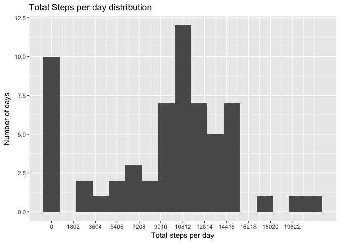
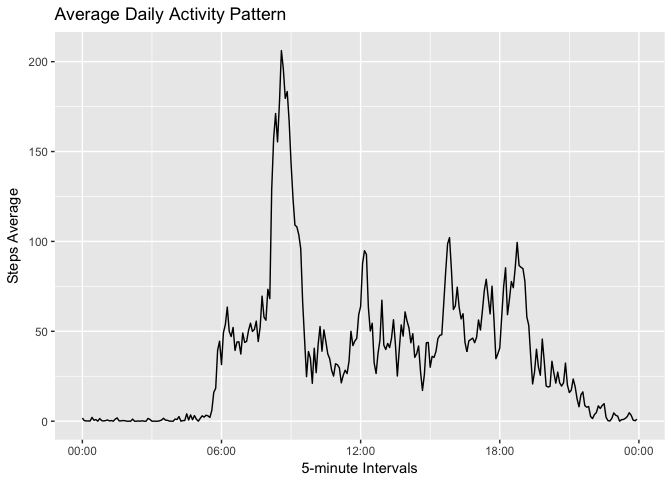
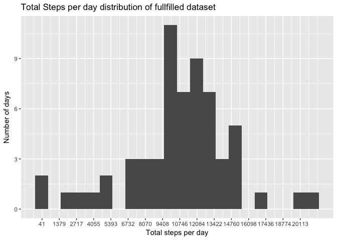
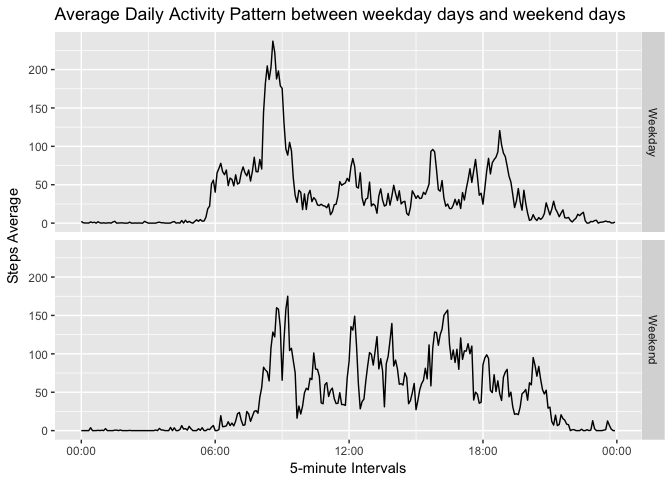

# Reproducible Research: Peer Assessment 1


## Introduction  
Data is stored in a CSV file, compressed in "activity.zip" in current working dir.  
Data consists of two months (October and November of 2012) of one aleatory device.  
There are 17,568 observations of variables:  

* steps: Number of steps taking in a 5-minute interval (missing values are coded as NA)  
* date: Day of observation formated as YYYY-MM-DD  
* interval: identifier for the 5-minute interval of current day  

## Loading and preprocessing the data  
Load required packages

```r
library(tidyr)
library(stringr)
library(dplyr)
```

```
## 
## Attaching package: 'dplyr'
```

```
## The following objects are masked from 'package:stats':
## 
##     filter, lag
```

```
## The following objects are masked from 'package:base':
## 
##     intersect, setdiff, setequal, union
```

```r
library(ggplot2)
library(xtable)
library(scales)
```

Unzip file, then read as CSV  

```r
d <- read.csv(unz("activity.zip","activity.csv"), stringsAsFactors = F,colClasses =   
                  c("integer","Date","integer"))
```

Better create one variable per 5-minute as agregations mostly are per day, spreading observations  
First standardize "interval" variable as it has 1, 2, 3 or 4 digits depends on time measured

```r
## Standardize interval
## 1. Break interval into separated digits
## 2. Fill NAs with zeros
## 3. Cast char matrix to num matrix

## One digit intervals
oneDigInterval <- str_match(d$interval,"^([05])$")
oneDigInterval <- cbind(oneDigInterval[,1],rep(NA,nrow(oneDigInterval)),
                        rep(NA,nrow(oneDigInterval)),
                        rep(NA,nrow(oneDigInterval)),oneDigInterval[,2])
oneDigInterval[is.na(oneDigInterval)] = 0
oneDigInterval <- apply(oneDigInterval,2,as.numeric)

## Two digit intervals
twoDigInterval <- str_match(d$interval,"^([0-5])([05])$")
twoDigInterval <- cbind(twoDigInterval[,1],rep(NA,nrow(twoDigInterval)),
                        rep(NA,nrow(twoDigInterval)),twoDigInterval[,2],
                        twoDigInterval[,3])
twoDigInterval[is.na(twoDigInterval)] = 0
twoDigInterval <- apply(twoDigInterval,2,as.numeric)

## Three digit interval
threeDigInterval <- str_match(d$interval,"^([0-9])([0-5])([05])$")
threeDigInterval <- cbind(threeDigInterval[,1],rep(NA,nrow(threeDigInterval)),
                          threeDigInterval[,2],threeDigInterval[,3],
                          threeDigInterval[,4])
threeDigInterval[is.na(threeDigInterval)] = 0
threeDigInterval <- apply(threeDigInterval,2,as.numeric)

## Four digit interval
fourDigInterval <- str_match(d$interval,"^([1-2])([0-9])([0-5])([05])$")
fourDigInterval[is.na(fourDigInterval)] = 0
fourDigInterval <- apply(fourDigInterval,2,as.numeric)

## merge all 4 matrix (1 dig, 2 dig, 3 dig, 4 dig)
## reduce list of matrix by sum its row,col values
## paste digits with format 1o dig2d dig:3th dig4th dig
l <- list(oneDigInterval,twoDigInterval,threeDigInterval,fourDigInterval)
digInterval <- Reduce("+",l)
interval <- apply(digInterval,1,function(r){paste(r[2],r[3],":",r[4],r[5],sep = "")})
d$interval <- interval

## Transform k/v steps and interval into variables and sort dataset by date
observations <- spread(data = d, key = interval, value = steps) %>% arrange(date)
```
observations is a data frame with 289 variables:  

* date: Date of measure
* hh:mm : 288 variables of each 5-minute interval 

## What is mean total number of steps taken per day?
First calculate total steps per date, then add this new variable to observations

```r
totalSteps <- apply(observations[,2:ncol(observations)],1,sum,na.rm = T)
observations <- cbind(observations,total.steps = totalSteps)
```

Now calculate mean and median total number of steps taken per day

```r
meanStepsObservations <- mean(observations$total.steps,na.rm = T)
medianStepsObservations <- median(observations$total.steps,na.rm = T)
stats <- data.frame(Mean = c(meanStepsObservations),Median = c(medianStepsObservations))
rownames(stats) <- c("All days")
```

To plot an histogram of total steps taken each day, histogram bin width needs to
be ajusted and scaled.  
I used a standard deviation of total steps by day and a 
parameter for this scale. 1/4 of standard deviation shows a good distribution of
those steps without too much aggregations.  
Also, ajust of X axis breaks is needed to be easier to visualize amounts of steps  


```r
## Use total steps standard deviation as a parameter to hist bin width
sdv <- sd(observations$total.steps)
minStepsDay <- min(observations$total.steps) ## Just to ajust X axis breaks
maxStepsDay <- max(observations$total.steps) ## Just to ajust X axis breaks

## Plot hist with ggplot
h <- qplot(total.steps,data = observations, binwidth = sdv/4) +
    scale_x_continuous(breaks = round(seq(minStepsDay,maxStepsDay, by = sdv/3),0)) + ## axis breaks
    ylab("Number of days") + xlab("Total steps per day") + ## labels
    ggtitle("Total Steps per day distribution") ## Graphic Title
```

Finally, this is the histogram of total number of steps taken each day  

```r
print(h)
```

<!-- -->

For those 61 days observations, **mean** and **median** total number of steps are 

```r
print(xtable(stats), type = "html", html.table.attributes="class='flat-table'")
```

<!-- html table generated in R 3.4.1 by xtable 1.8-2 package -->
<!-- Sat Sep  2 18:59:09 2017 -->
<table class='flat-table'>
<tr> <th>  </th> <th> Mean </th> <th> Median </th>  </tr>
  <tr> <td align="right"> All days </td> <td align="right"> 9354.23 </td> <td align="right"> 10395 </td> </tr>
   </table>

## What is the average daily activity pattern?
To get an average daily activity pattern, I calculate the mean of each 5-minute interval, as they are variables of observations set.  
Then, I just gather variables into key-value pair of 5-minute POXISct interval-number of steps and format date as HH:MM string format.  
Finnaly, I get the maximum number of steps interval with a simple filter


```r
## get mean of intervals over days
dailyMean <- apply(observations[,2:289],2,mean,na.rm = T) 

## Gather and format dataset to key-value HH:MM-Average of steps
pattern <- data.frame(intervals = as.POSIXct(names(dailyMean), format = "%H:%M"), 
                      steps = dailyMean, stringsAsFactors = F)

g <- ggplot(pattern,aes(x = intervals, y = steps)) + 
    scale_x_datetime(labels = date_format(format = "%H:%M", 
                                          tz = Sys.timezone())) + geom_line()
g <- g + xlab("5-minute Intervals") + ylab("Steps Average") + 
    ggtitle("Average Daily Activity Pattern")
print(g)
```

<!-- -->

```r
## Get the interval with maximum number of steps
maxInterval <- pattern %>% filter(steps == max(steps))
```

At **08:35** occurs the average maximum number of steps taken as **206.17**.  

## Imputing missing values

There are some missing values on this dataset. Before fill those values, let's see how many rows have missing values NAs.  

```r
## Get total of missing values excluding date variable and mean variable
totalMissing <- sum(is.na(observations[,2:289]))
## Get days where there are missing values
idxMissingDays <- unique(which(is.na(observations[,2:289]),arr.ind = T)[,1])
missingDays <- observations[idxMissingDays,]
## Count values missing in each day and get number of missing days
totalMissingPerDay <- apply(is.na(missingDays[,2:289]),1,sum)
totalMissingDays <- length(missingDays$date)
```


This dataset has **2304** missing values on days:  

```r
## Format missing days for report
daysMissingValues <- data.frame(Days = format(missingDays$date,"%m-%d-%Y"), 
                                Weekday = weekdays(missingDays$date),
                                Total.Missing = totalMissingPerDay)
print(xtable(daysMissingValues),type = "html")
```

<!-- html table generated in R 3.4.1 by xtable 1.8-2 package -->
<!-- Sat Sep  2 18:59:10 2017 -->
<table border=1>
<tr> <th>  </th> <th> Days </th> <th> Weekday </th> <th> Total.Missing </th>  </tr>
  <tr> <td align="right"> 1 </td> <td> 10-01-2012 </td> <td> Monday </td> <td align="right"> 288 </td> </tr>
  <tr> <td align="right"> 8 </td> <td> 10-08-2012 </td> <td> Monday </td> <td align="right"> 288 </td> </tr>
  <tr> <td align="right"> 32 </td> <td> 11-01-2012 </td> <td> Thursday </td> <td align="right"> 288 </td> </tr>
  <tr> <td align="right"> 35 </td> <td> 11-04-2012 </td> <td> Sunday </td> <td align="right"> 288 </td> </tr>
  <tr> <td align="right"> 40 </td> <td> 11-09-2012 </td> <td> Friday </td> <td align="right"> 288 </td> </tr>
  <tr> <td align="right"> 41 </td> <td> 11-10-2012 </td> <td> Saturday </td> <td align="right"> 288 </td> </tr>
  <tr> <td align="right"> 45 </td> <td> 11-14-2012 </td> <td> Wednesday </td> <td align="right"> 288 </td> </tr>
  <tr> <td align="right"> 61 </td> <td> 11-30-2012 </td> <td> Friday </td> <td align="right"> 288 </td> </tr>
   </table>

   
As seen, all days that has missing values are completelly blank, that is, there 
isn't any missing value between other values. There are only blank days.  
If we look at Weekday column, we can get that there isn't a special weekday that values are missing. So, let's use mean of steps taken for each 5-minute interval of complete days that are the same weekdays of missing dates.  


```r
## Start setting weekday to observations dataset
observations$weekday <- weekdays(observations$date)
## Get only days with complete value set, idxMissingDays was set above with 
##   row number of days with missing values
fullObservations <- observations[-idxMissingDays,2:ncol(observations)]
meanPerWeekDay <- fullObservations %>% group_by(weekday) %>% summarise_all(funs(mean))

## Creating a new dataset to be filled
filledObservations <- observations

## Let's now fill missing values with mean of same week day
## Using idxMissingDays as iterator, lets go and complete those days

## First get values for missing days and sort then by date variable
filledDays <- merge(filledObservations[idxMissingDays,c("date","weekday")],meanPerWeekDay,by = "weekday")
filledDays <- filledDays %>% arrange(date)

## Now let's complete new dataset filledObservations with missing vales
filledObservations[idxMissingDays,2:290] <- filledDays[,3:291]
```

With dataset fullfilled, we can plot a new histogram of total steps and compare mean and median values with uncomplete dataset.

Let's use the same strategy to plot new histogram  


```r
## Use total steps standard deviation as a parameter to hist bin width
sdvFullDS <- sd(filledObservations$total.steps)
minStepsDayFullDS <- min(filledObservations$total.steps) ## Just to ajust X axis breaks
maxStepsDayFullDS <- max(filledObservations$total.steps) ## Just to ajust X axis breaks

## Plot hist with ggplot
hFullDS <- qplot(total.steps,data = filledObservations, binwidth = sdvFullDS/4) + 
    scale_x_continuous(breaks = round(seq(minStepsDayFullDS,maxStepsDayFullDS, by = sdvFullDS/3),0)) + ## axis breaks
    ylab("Number of days") + xlab("Total steps per day") + ## labels
    ggtitle("Total Steps per day distribution of fullfilled dataset") ## Graphic Title
```

Now calculate mean and median total number of steps taken per day for fullfilled DS  

```r
meanStepsObservationsFullDS <- mean(filledObservations$total.steps)
medianStepsObservationsFullDS <- median(filledObservations$total.steps)
statsFullDS <- data.frame(Mean = c(meanStepsObservations,meanStepsObservationsFullDS),
                          Median = c(medianStepsObservations,medianStepsObservationsFullDS))
## Also, let's see percentage variation with new values to the dataset
variation <- apply(statsFullDS,2,function(d) 1 - (d[1]/d[2]))
statsFullDS <- rbind(statsFullDS,variation)
rownames(statsFullDS) <- c("With missing values", "Complete dataset", "Variation")
```

This is the new histogram of fullfilled dataset  

```r
print(hFullDS)
```

<!-- -->

And those are the new values for mean and median of steps taken

```r
print(xtable(statsFullDS, caption = c("Mean and Median comparation of uncomplete and complete datasets")), type = "html",
      html.table.attributes="class='flat-table'")
```

<!-- html table generated in R 3.4.1 by xtable 1.8-2 package -->
<!-- Sat Sep  2 18:59:11 2017 -->
<table class='flat-table'>
<caption align="bottom"> Mean and Median comparation of uncomplete and complete datasets </caption>
<tr> <th>  </th> <th> Mean </th> <th> Median </th>  </tr>
  <tr> <td align="right"> With missing values </td> <td align="right"> 9354.23 </td> <td align="right"> 10395.00 </td> </tr>
  <tr> <td align="right"> Complete dataset </td> <td align="right"> 10821.21 </td> <td align="right"> 11015.00 </td> </tr>
  <tr> <td align="right"> Variation </td> <td align="right"> 0.14 </td> <td align="right"> 0.06 </td> </tr>
   </table>

As table above shows, filling missing values increases both mean steps taken and median of steps. But mean had an significant increase of 13.56% and median just had a smaller increase of 5.63%.  

## Are there differences in activity patterns between weekdays and weekends?
To do comparation of activity patterns between weekdays and weekends, first we need to classify all observations into weekday or weekend.  
I create a boolean factor telling it a specific date is a weekend day.  

```r
## Working days of a week
workingDays <- c('Monday', 'Tuesday', 'Wednesday', 'Thursday', 'Friday')

## fullfilled dataset already has a variable with weed day name, so, we need just 
##   to classify all observations based on this variable
filledObservations$day.classification <- factor(filledObservations$weekday %in% workingDays,
                                                levels = c(F,T), 
                                                labels = c("Weekend","Weekday"))

## Let's group values by classification factor and calculate mean of each 5-minute interval
dailyMeansByDayClassification <- filledObservations[,c(2:290,292)] %>% 
    group_by(day.classification) %>% 
    summarise_all(funs(mean))
```

This new object, dailyMeansByDayClassification, has 2 observations and means of all 5-minute variables and total.steps variable. Now it's possible to create a new object just with 3 variables: interval (5-minute), classification (weekday,weekend), steps (mean steps taken)


```r
## Create a dataframe with HH:MM - Weekday Steps - Weekend steps variables
## There are 290 variables on dailyMeansByDayClassification, first is day.classification
##   end last is total.steps, so, we only need 288 variables between first and last or 2:289
intervalNames <- names(dailyMeansByDayClassification[,2:289])
pattern <- data.frame(intervals = as.POSIXct(intervalNames,
                                             format = "%H:%M"), 
                      Weekend = unlist(dailyMeansByDayClassification[1,2:289]),
                      Weekday = unlist(dailyMeansByDayClassification[2,2:289]), 
                      stringsAsFactors = F)
## Now gather it to Interval - Classification - Steps
pattern <- pattern %>% gather(classification,steps, Weekend:Weekday)
```


Now, let's plot two piled up panels to compare activities between weekdays and weekends.


```r
g <- ggplot(pattern,aes(x = intervals, y = steps)) + 
    facet_grid(classification~.) + 
    scale_x_datetime(labels = date_format(format = "%H:%M", 
                                          tz = Sys.timezone())) + geom_line() + 
    xlab("5-minute Intervals") + ylab("Steps Average") + 
    ggtitle("Average Daily Activity Pattern between weekday days and weekend days")
print(g)
```

<!-- -->
